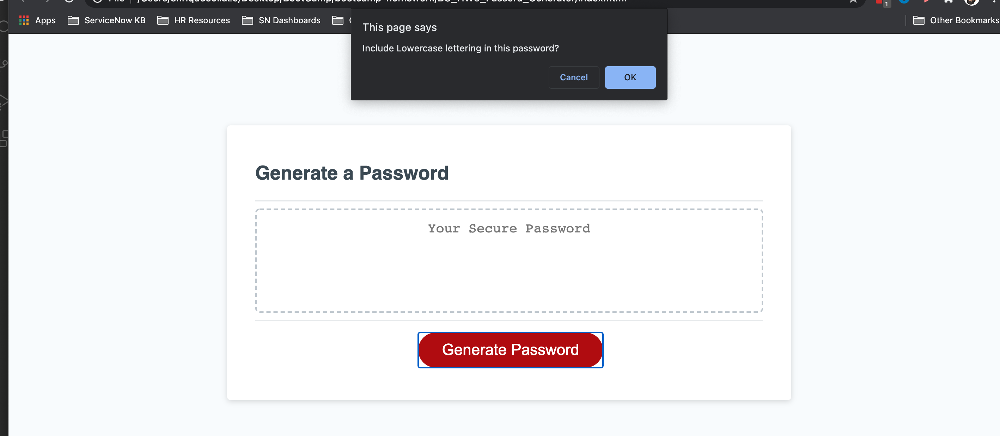

# BC_HW3_Passord_Generator

Welcome to my repository! This repository was created to show my knowledge in Javascript by creating a password generator that will create a password based on the prompt & confirm responses submitted by a user.

[Password Generator](https://02dade12.github.io/Workday_Scheduler/)

## Screenshot of Steps & Functionality below

